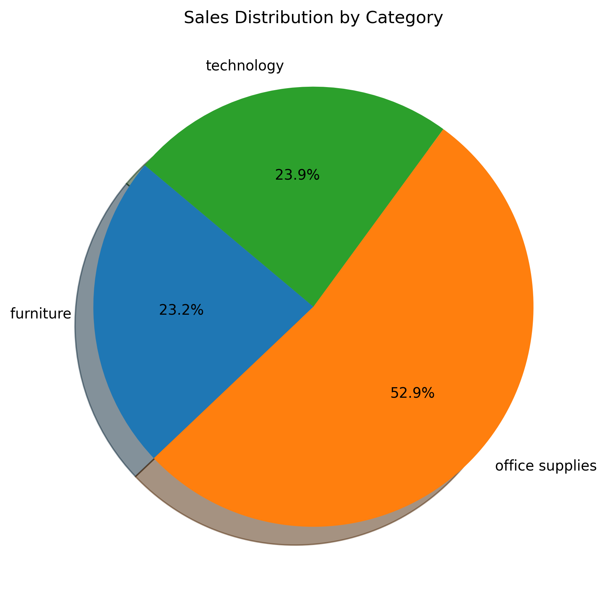
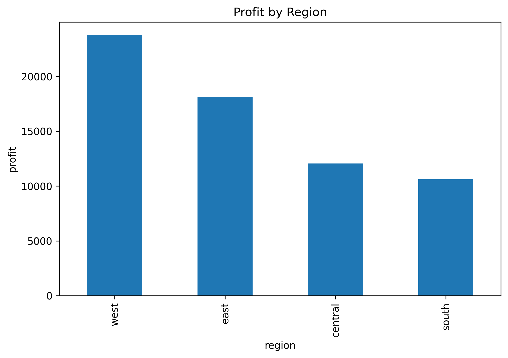
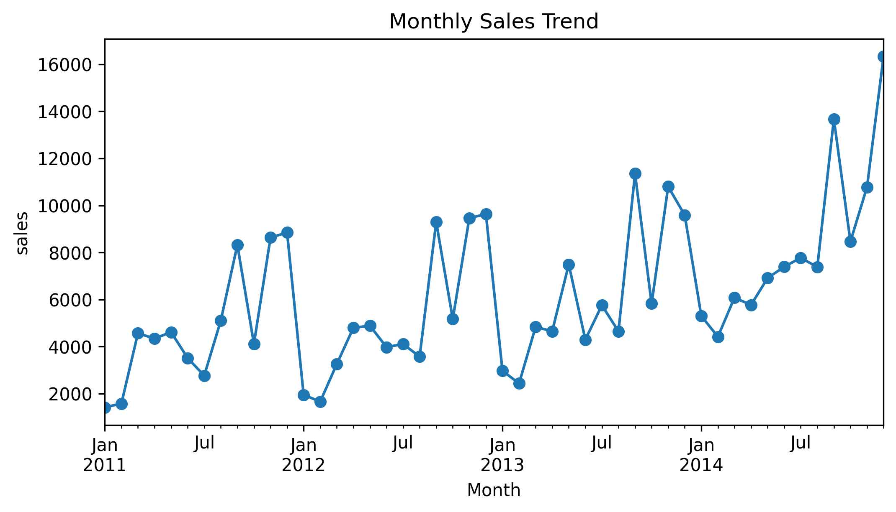
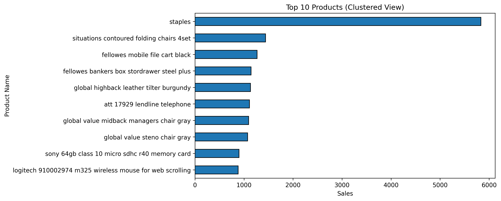

# TITLE:

# 📊 Retail Sales Analysis Report
## Global Superstore Dataset

---

## 📌 Introduction

The objective of this project is to analyze retail sales data and identify key business insights.

This analysis focuses on:
- Sales performance
- Profit analysis
- Regional performance
- Product performance

The findings can help businesses make better data-driven decisions.

---

## 📂 Dataset Information

- Dataset: Global Superstore
- Rows: 5000+
- Columns: Sales, Profit, Region, Category, Segment, Product Name

---

## 🧹 Data Cleaning Process

The following data cleaning steps were performed:

- Removed missing values
- Removed duplicate records
- Corrected data types
- Standardized date format
- Removed extra spaces from text fields
- Standardized text formatting

The cleaned dataset was then used for further analysis and visualization.

---

## 📦 Category Wise Sales Analysis

### Findings:
- Technology generated the highest sales.
- Office Supplies showed stable sales performance.
- Furniture contributed lower sales compared to other categories.

### Insight:
Technology products were the major contributors to overall revenue.

---

## 📈 Profit by Region Analysis

### Findings:
- West region generated the highest profit.
- East region also performed well.
- Some regions had lower profitability despite generating sales.

### Insight:
The West region was the most profitable area for the business.

---

## 👥 Segment Sales Analysis

### Findings:
- Consumer segment generated the highest sales.
- Corporate segment maintained steady revenue.
- Home Office segment contributed the lowest sales.

### Insight:
Consumer customers were the primary source of revenue.

---
## 📅 Monthly Sales Trend Analysis

### Findings:
- Sales fluctuated across different months.
- Certain months showed peak performance.
- Some months experienced lower sales periods.
- Seasonal patterns were clearly visible in sales data.

### Insight:
Monthly sales trends help in understanding demand patterns and improving forecasting and inventory planning.

---

## 🏆 Top 10 Products Analysis

### Findings:
- Top products generated a significant share of total revenue.
- Sales were concentrated among a small number of products.
- High-demand products consistently performed well.

### Insight:
A few products played a major role in driving business sales.

---
## 🔍 Key Insights

- Technology was the best-performing category.
- West region generated the highest profit.
- Consumer segment contributed the highest sales.
- Top-performing products drove most of the revenue.
- Sales showed clear monthly trends.

---

## 💡 Business Recommendations

- Focus on Technology products to increase revenue.
- Improve performance in low-profit regions.
- Target the Consumer segment for growth.
- Promote top-selling products more.
- Use monthly trends for better planning.

---

## 🏁 Conclusion

This project shows that Technology, West region, and Consumer segment are the top contributors. Monthly trends help in understanding sales patterns and improving business decisions.

